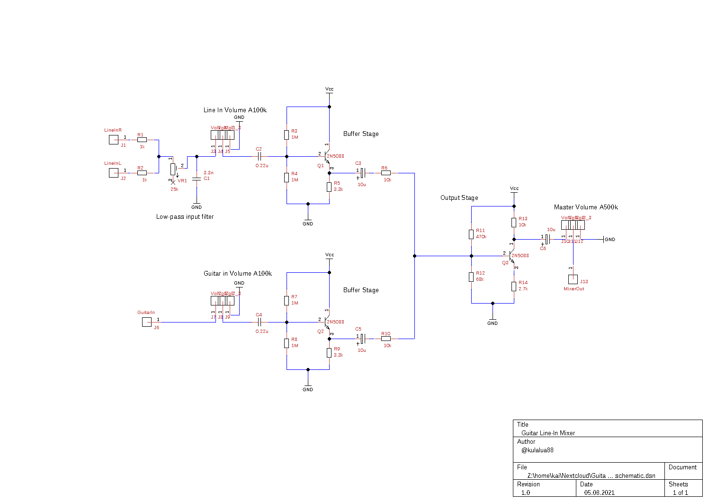
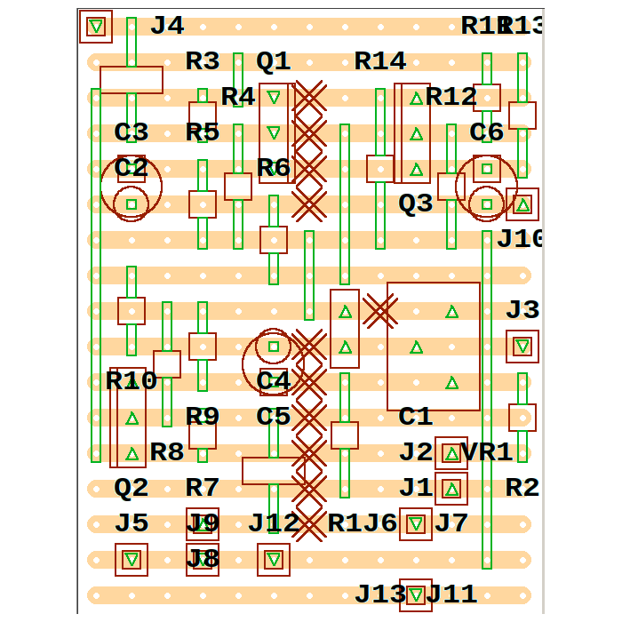

# LineInMixer

This is a project for a 2 channel line in audio mixer.
In my case, I use it to mix my electric guitar signal with the stereo signal from my phone to a single mono output. Both inputs are buffered and have separate volume controls. The mixed signal goes through a simple output stage with a master volume control.

## Features
* 1 stereo input (line in: is converted to mono, e.g. audio coming from a phone)
* lowpass filter for line in
* 1 mono input (e.g. electric guitar)
* both input channels are buffered
* input volume control for each input channel
* mixed audio inputs go through an amplifier output stage
* master volume for output

## Files
* TinyCAD files are in the TinyCAD directory.
* VeeCAD files are in the VeeCAD directory.
* LTspice files are in the LTSpice directory.

## Schematic
The schematic is drawn by TinyCAD.

## Strip board layout
I used VeeCAD to create a stripboard layout.

